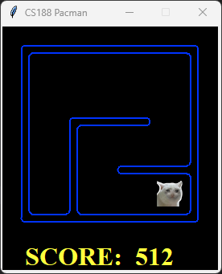
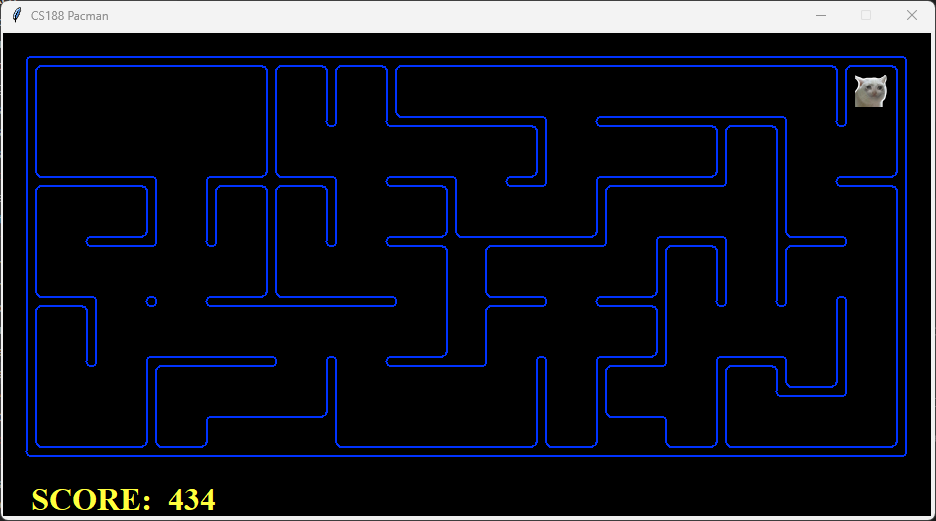
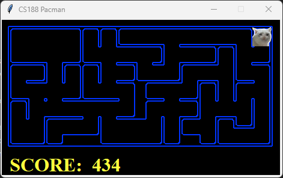
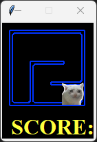
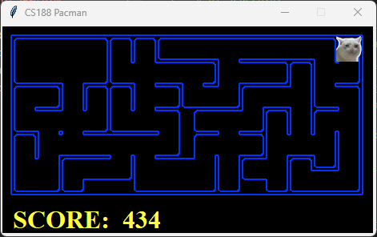

# EECS 118 Project 3 Test Results

Testing in progress. 

Completed: E31 and E32.

## E31 -- Implement A\* Search Algorithm

### E31 Autograder Results

```
$ python autograder.py -q E31

Starting on 12-8 at 21:49:54

Question E31
============
*** PASS: test_cases\E31\astar_0.test
***     solution:               ['Right', 'Down', 'Down']
***     expanded_states:        ['A', 'B', 'D', 'C', 'G']
*** PASS: test_cases\E31\astar_1_graph_heuristic.test
***     solution:               ['0', '0', '2']
***     expanded_states:        ['S', 'A', 'D', 'C']
*** PASS: test_cases\E31\astar_2_manhattan.test
***     pacman layout:          mediumMaze
***     solution length: 68
***     nodes expanded:         222
*** PASS: test_cases\E31\astar_3_goalAtDequeue.test
***     solution:               ['1:A->B', '0:B->C', '0:C->G']
***     expanded_states:        ['A', 'B', 'C']
*** PASS: test_cases\E31\astar_expand_1.test
***     solution:               ['0', '0', '0']
***     expanded_states:        ['Q', 'B', 'A', 'B']
*** PASS: test_cases\E31\astar_expand_2.test
***     solution:               ['0:A->B', '0:B->C', '0:C->D', '0:D->E', '0:E->F', '0:F->G']
***     expanded_states:        ['A', 'C', 'D', 'F', 'E', 'F', 'B', 'C', 'D', 'E', 'F']
*** PASS: test_cases\E31\graph_backtrack.test
***     solution:               ['1:A->C', '0:C->G']
***     expanded_states:        ['A', 'B', 'C', 'D']
*** PASS: test_cases\E31\graph_manypaths.test
***     solution:               ['1:A->C', '0:C->D', '1:D->F', '0:F->G']
***     expanded_states:        ['A', 'B1', 'C', 'B2', 'D', 'E1', 'F', 'E2']

### Question E31: 15/15 ###


Finished at 21:49:54

Provisional grades
==================
Question E31: 15/15
------------------
Total: 15/15

Your grades are NOT yet registered.  To register your grades, make sure
to follow your instructor's guidelines to receive credit on your project.
```

### E31 Testing

Test case given for E31 is actually a duplicate of the first one for E32.

---

## E32 -- Multi-Corner Navigation (CornersProblem)

### E32 Autograder Results

```
$ python autograder.py -q E32

Note: due to dependencies, the following tests will be run: E15 E32
Starting on 12-8 at 21:51:21

Question E15
============
*** PASS: test_cases\E15\graph_backtrack.test
***     solution:               ['1:A->C', '0:C->G']
***     expanded_states:        ['A', 'B', 'C', 'D']
*** PASS: test_cases\E15\graph_bfs_vs_dfs.test
***     solution:               ['1:A->G']
***     expanded_states:        ['A', 'B']
*** PASS: test_cases\E15\graph_infinite.test
***     solution:               ['0:A->B', '1:B->C', '1:C->G']
***     expanded_states:        ['A', 'B', 'C']
*** PASS: test_cases\E15\graph_manypaths.test
***     solution:               ['1:A->C', '0:C->D', '1:D->F', '0:F->G']
***     expanded_states:        ['A', 'B1', 'C', 'B2', 'D', 'E1', 'F', 'E2']
*** PASS: test_cases\E15\pacman_1.test
***     pacman layout:          mediumMaze
***     solution length: 68
***     nodes expanded:         269

### Question E15: 20/20 ###


Question E32
============
*** PASS: test_cases\E32\corner_tiny_corner.test
***     pacman layout:          tinyCorner
***     solution length:                28

### Question E32: 15/15 ###


Finished at 21:51:21

Provisional grades
==================
Question E15: 20/20
Question E32: 15/15
------------------
Total: 35/35

Your grades are NOT yet registered.  To register your grades, make sure
to follow your instructor's guidelines to receive credit on your project.
```

### E32 Testing

**E32.1. Tiny Corners Layout with Breadth First Search (BFS)**



```
$ python catman.py -l tinyCorners -p SearchAgent -a fn=astar,prob=CornersProblem --frameTime 0.5
[SearchAgent] using function astar and heuristic nullHeuristic
[SearchAgent] using problem type CornersProblem
AGENT INDEX: 0 TYPE: True
Path found with total cost of 28 in 0.0 seconds
Search nodes expanded: 252
Pacman emerges victorious! Score: 512
Average Score: 512.0
Scores:        512.0
Win Rate:      1/1 (1.00)
Record:        Win
```

**E32.2. Medium Corners Layout with Uniform Cost Search (UCS)**



```
$ python catman.py -l mediumCorners -p SearchAgent -a fn=ucs,prob=CornersProblem --frameTime 0.5

[SearchAgent] using function ucs
[SearchAgent] using problem type CornersProblem
AGENT INDEX: 0 TYPE: True
<p1_Search.node object at 0x00000137C7702850>
Path found with total cost of 106 in 0.0 seconds
Search nodes expanded: 1966
Pacman emerges victorious! Score: 434
Average Score: 434.0
Scores:        434.0
Win Rate:      1/1 (1.00)
Record:        Win
```

**E32.3. Medium Corners Layout with A\* Search**

 
```
$ python catman.py -l mediumCorners -p AStarCornersAgent -z 0.5

AGENT INDEX: 0 TYPE: True
Path found with total cost of 106 in 0.0 seconds
Search nodes expanded: 692
Pacman emerges victorious! Score: 434
Average Score: 434.0
Scores:        434.0
Win Rate:      1/1 (1.00)
Record:        Win
```

---

## E33 -- Admissible Heuristic for the Corners Problem

### E33 Autograder Results

```
python autograder.py -q E33
```

### E33 Testing

**E33.1 Tiny Corners with A\* Search**



```
$ python catman.py -l tinyCorners -p AStarCornersAgent -z 0.5

AGENT INDEX: 0 TYPE: True
Path found with total cost of 28 in 0.0 seconds
Search nodes expanded: 155
Pacman emerges victorious! Score: 512
Average Score: 512.0
Scores:        512.0
Win Rate:      1/1 (1.00)
Record:        Win
```

**E33.2 Medium Corners with A\* Search**



```
$ python catman.py -l mediumCorners -p AStarCornersAgent -z 0.5

AGENT INDEX: 0 TYPE: True
Path found with total cost of 106 in 0.0 seconds
Search nodes expanded: 692
Pacman emerges victorious! Score: 434
Average Score: 434.0
Scores:        434.0
Win Rate:      1/1 (1.00)
Record:        Win
```

## E34 -- Food Search Heuristic (Many-Goal Search)

### E34 Autograder Results

```
python autograder.py -q E34
```

### E34 Testing

**E34.1 Food Search - Test Search Layout**
```
python catman.py -l testSearch -p AStarFoodSearchAgent
```

**E34.2 Food Search - Tiny Search Layout**
```
python catman.py -l tinySearch -p AStarFoodSearchAgent
```

**E34.3 Food Search - Tricky Search Layout**
```
python catman.py -l trickySearch -p AStarFoodSearchAgent
```

**E34.4 Food Search - Medium Search Layout**
```
python catman.py -l mediumSearch -p AStarFoodSearchAgent
```

---

## E35 -- Closest-Dot Search (Greedy Repeated BFS)

### E35 Autograder Results

```
python autograder.py -q E35
```

### E35 Testing

**E35.1 Closest-Dot Search - Test Search Layout**
```
python catman.py -l testSearch -p ClosestDotSearchAgent
```

**E35.2 Closest-Dot Search - Tiny Search Layout**
```
python catman.py -l tinySearch -p ClosestDotSearchAgent
```

**E35.3 Closest-Dot Search - Tricky Search Layout**
```
python catman.py -l trickySearch -p ClosestDotSearchAgent
```

**E35.4 Closest-Dot Search - Medium Search Layout**
```
python catman.py -l mediumSearch -p ClosestDotSearchAgent
```
