# EECS 118 Project 4 Test Results

Here are the successful results from the autograder and all secondary testing.

## E41 -- Value Iteration

### E41 Autograder Results

```
$ python autograder.py -q E41

Starting on 12-8 at 0:50:11

Question E41
============

*** PASS: test_cases\E41\1-tinygrid.test
*** PASS: test_cases\E41\2-tinygrid-noisy.test
*** PASS: test_cases\E41\3-bridge.test
*** PASS: test_cases\E41\4-discountgrid.test

### Question E41: 30/30 ###


Finished at 0:50:11

Provisional grades
==================
Question E41: 30/30
------------------
Total: 30/30

Your grades are NOT yet registered.  To register your grades, make sure
to follow your instructor's guidelines to receive credit on your project.

```

### E41 Testing

```
$ python gridworld.py -a value -i 50 -k 10
```


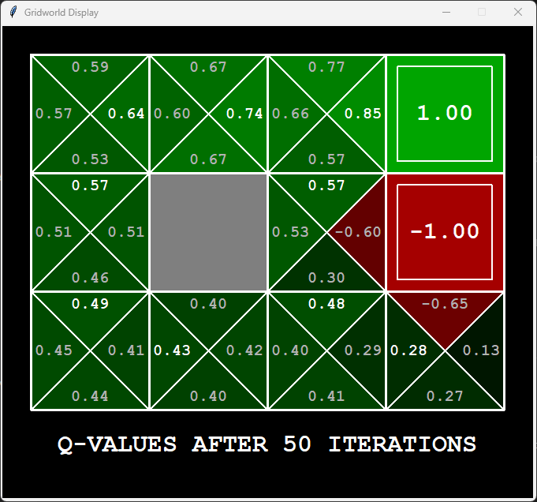

---

# E42 -- Designing a Reward Structure

### E42 Autograder

```
$ python autograder.py -q E42
Starting on 12-8 at 0:54:36

Question E42
============

*** PASS: test_cases\E42\1-question-2.1.test
*** PASS: test_cases\E42\2-question-2.2.test
*** PASS: test_cases\E42\3-question-2.3.test
*** PASS: test_cases\E42\4-question-2.4.test
*** PASS: test_cases\E42\5-question-2.5.test

### Question E42: 20/20 ###


Finished at 0:54:36

Provisional grades
==================
Question E42: 20/20
------------------
Total: 20/20

Your grades are NOT yet registered.  To register your grades, make sure
to follow your instructor's guidelines to receive credit on your project.
```

### E42 Testing

**Question 2a**

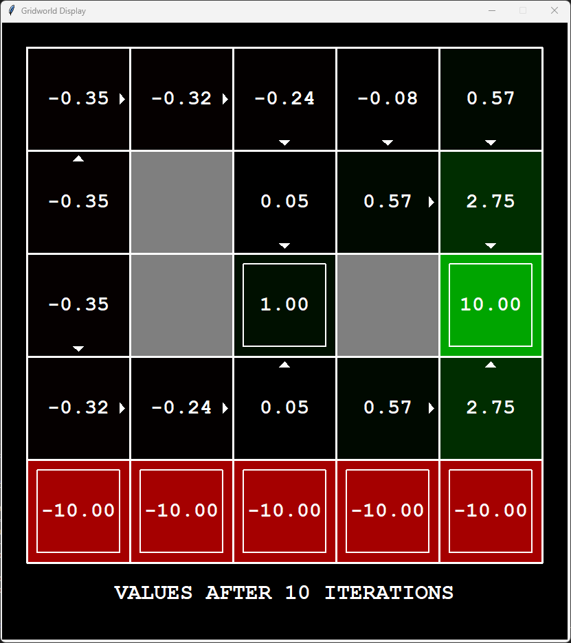

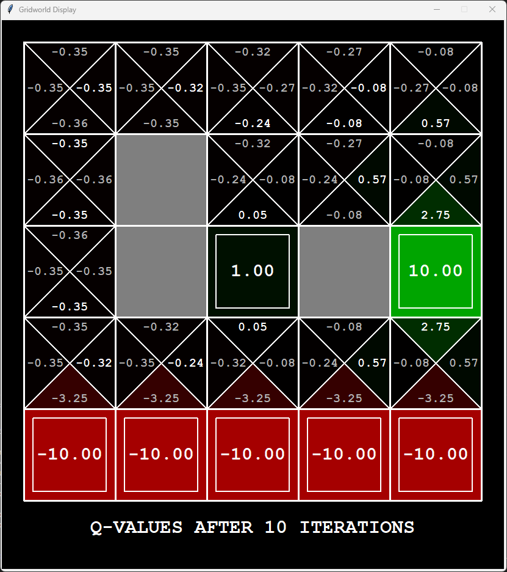

```
$ python gridworld.py -g DiscountGrid -a value --discount 0.3 --noise 0 --livingReward -0.25

RUNNING 1 EPISODES

BEGINNING EPISODE: 1

Started in state: (0, 1)
Took action: east
Ended in state: (1, 1)
Got reward: -0.25

Started in state: (1, 1)
Took action: east
Ended in state: (2, 1)
Got reward: -0.25

Started in state: (2, 1)
Took action: north
Ended in state: (2, 2)
Got reward: -0.25

Started in state: (2, 2)
Took action: exit
Ended in state: TERMINAL_STATE
Got reward: 1

EPISODE 1 COMPLETE: RETURN WAS -0.3205


AVERAGE RETURNS FROM START STATE: -0.3205
```


**Question 2b**

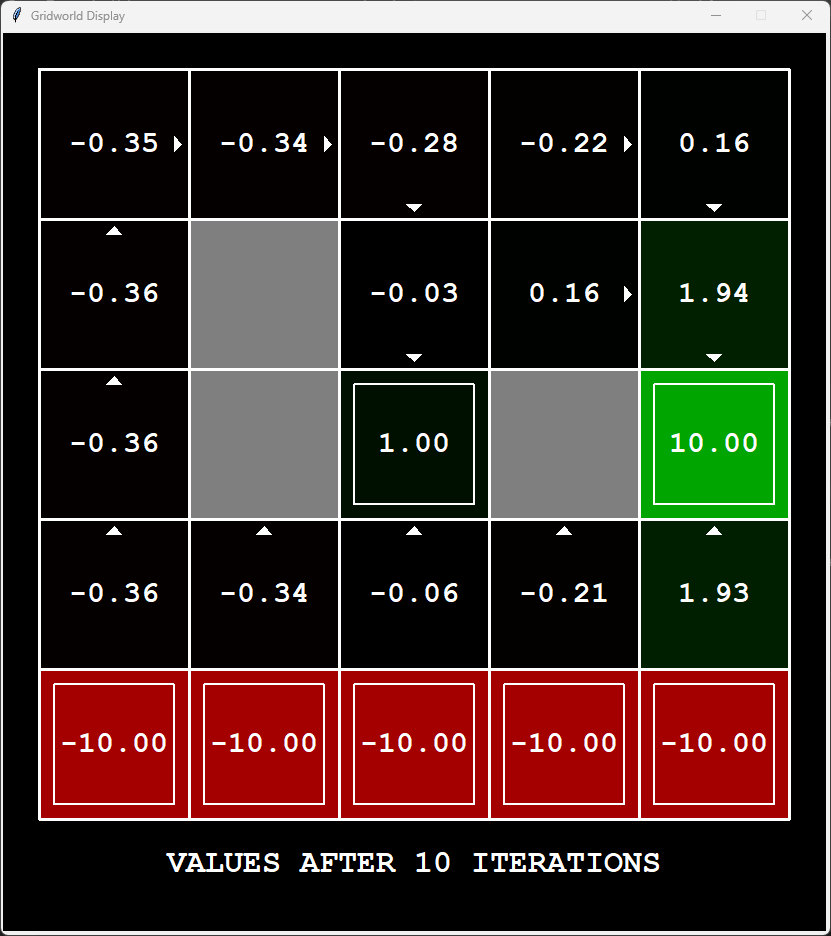


```
$ python gridworld.py -g DiscountGrid -a value --discount 0.3 --noise 0.3 --livingReward -0
.25

RUNNING 1 EPISODES

BEGINNING EPISODE: 1

Started in state: (0, 1)
Took action: north
Ended in state: (0, 2)
Got reward: -0.25

Started in state: (0, 2)
Took action: north
Ended in state: (0, 3)
Got reward: -0.25

Started in state: (0, 3)
Took action: north
Ended in state: (0, 4)
Got reward: -0.25

Started in state: (0, 4)
Took action: east
Ended in state: (1, 4)
Got reward: -0.25

Started in state: (1, 4)
Took action: east
Ended in state: (2, 4)
Got reward: -0.25

Started in state: (2, 4)
Took action: south
Ended in state: (1, 4)
Got reward: -0.25

Started in state: (1, 4)
Took action: east
Ended in state: (2, 4)
Got reward: -0.25

Started in state: (2, 4)
Took action: south
Ended in state: (2, 3)
Got reward: -0.25

Started in state: (2, 3)
Took action: south
Ended in state: (2, 3)
Got reward: -0.25

Started in state: (2, 3)
Took action: south
Got reward: -0.25

Started in state: (2, 2)
Took action: exit
Ended in state: TERMINAL_STATE
Got reward: 1

EPISODE 1 COMPLETE: RETURN WAS -0.35713484335


AVERAGE RETURNS FROM START STATE: -0.35713484335    
```


**Question 2c**

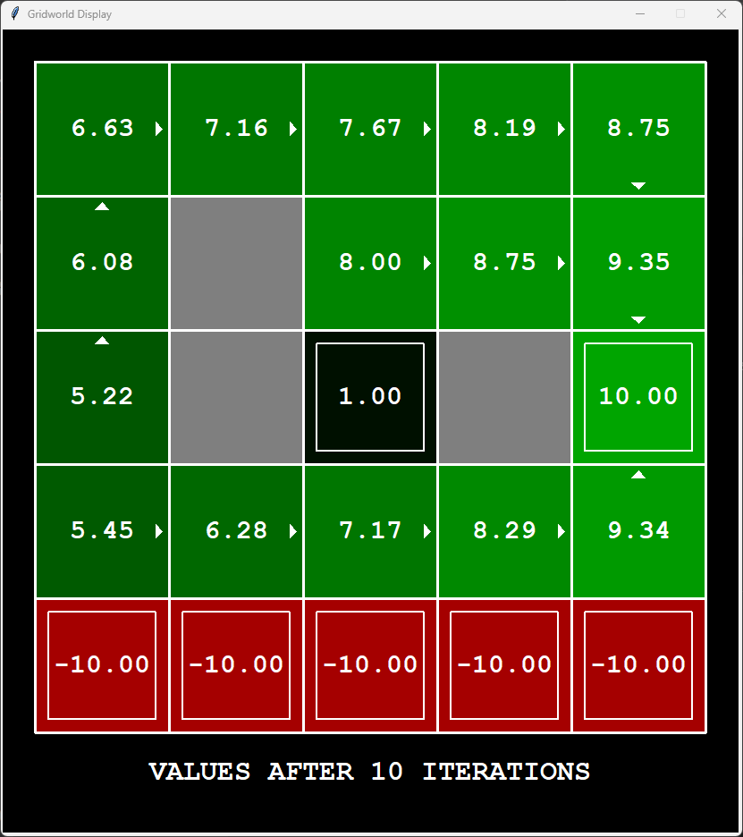

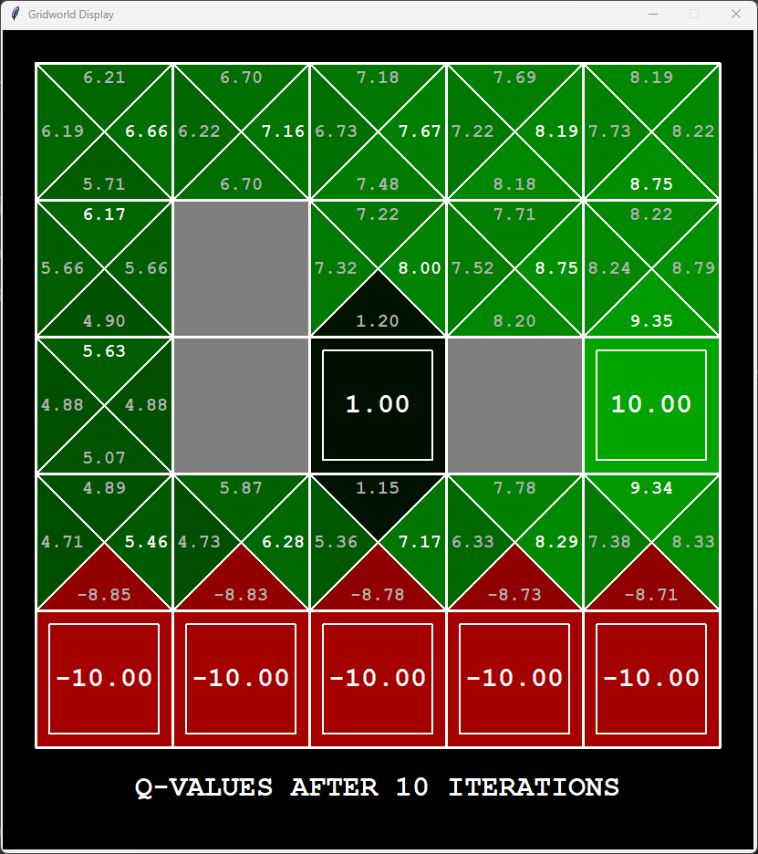

```
$ python gridworld.py -g DiscountGrid -a value --discount 0.95 --noise 0.05 --livingReward 
-0.1 

RUNNING 1 EPISODES

BEGINNING EPISODE: 1

Started in state: (0, 1)
Took action: east
Ended in state: (1, 1)
Got reward: -0.1

Started in state: (1, 1)
Took action: east
Ended in state: (1, 0)
Got reward: -0.1

Started in state: (1, 0)
Took action: exit
Ended in state: TERMINAL_STATE
Got reward: -10

EPISODE 1 COMPLETE: RETURN WAS -9.22


AVERAGE RETURNS FROM START STATE: -9.22
```


**Question 2d**

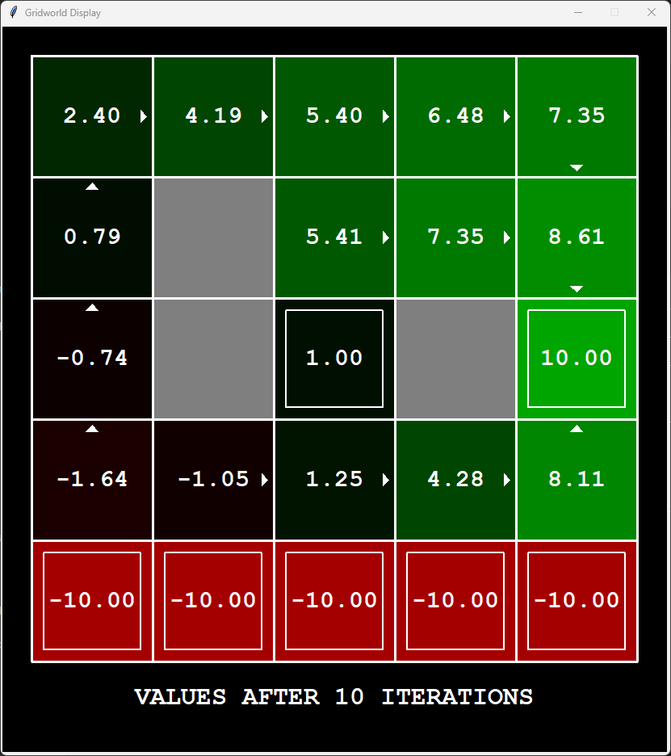

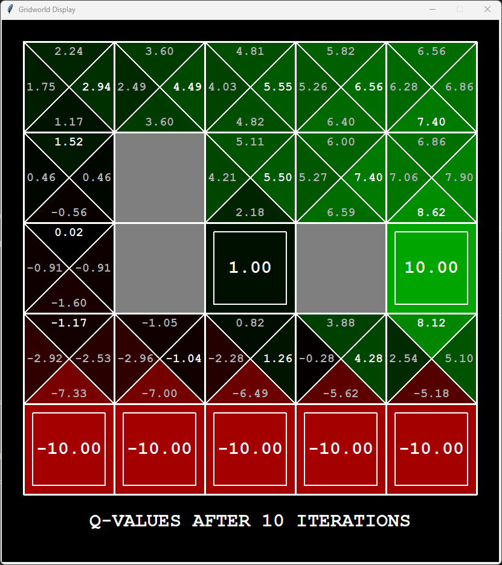

```
$ python gridworld.py -g DiscountGrid -a value --discount 0.95 --noise 0.3 --livingReward -
0.3 

RUNNING 1 EPISODES

BEGINNING EPISODE: 1

Started in state: (0, 1)
Took action: north
Ended in state: (0, 2)
Got reward: -0.3

Started in state: (0, 2)
Took action: north
Ended in state: (0, 2)
Got reward: -0.3

Started in state: (0, 2)
Took action: north
Ended in state: (0, 3)
Got reward: -0.3

Started in state: (0, 3)
Took action: north
Ended in state: (0, 3)
Got reward: -0.3

Started in state: (0, 3)
Took action: north
Ended in state: (0, 4)
Got reward: -0.3

Started in state: (0, 4)
Took action: east
Ended in state: (0, 4)
Got reward: -0.3

Started in state: (0, 4)
Took action: east
Ended in state: (1, 4)
Got reward: -0.3

Started in state: (1, 4)
Took action: east
Ended in state: (1, 4)
Got reward: -0.3

Started in state: (1, 4)
Took action: east
Ended in state: (2, 4)
Got reward: -0.3

Started in state: (2, 4)
Took action: east
Ended in state: (3, 4)
Got reward: -0.3

Started in state: (3, 4)
Took action: east
Ended in state: (4, 4)
Got reward: -0.3

Started in state: (4, 4)
Took action: south
Ended in state: (4, 3)
Got reward: -0.3

Started in state: (4, 3)
Took action: south
Ended in state: (4, 2)
Got reward: -0.3

Started in state: (4, 2)
Took action: exit
Ended in state: TERMINAL_STATE
Got reward: 10

EPISODE 1 COMPLETE: RETURN WAS 2.2134733324720783


AVERAGE RETURNS FROM START STATE: 2.2134733324720783
```


**Question 2e**

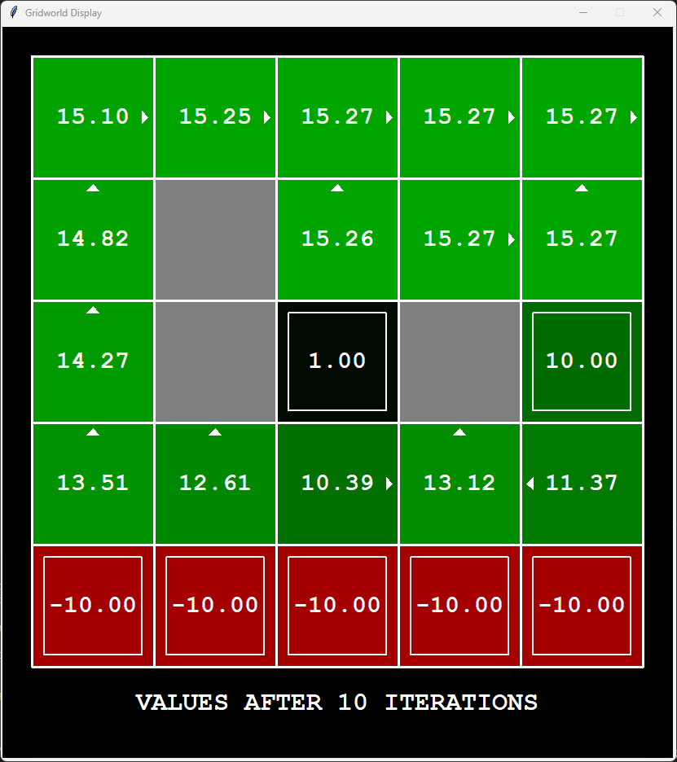

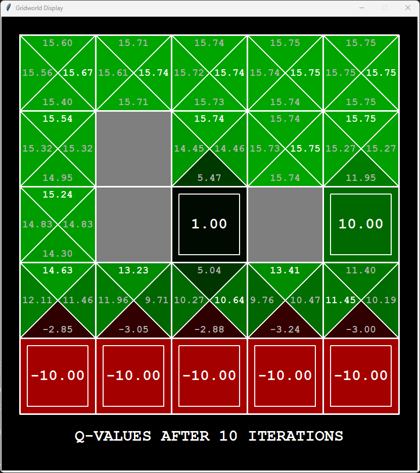

```
$ python gridworld.py -g DiscountGrid -a value --discount 0.9 --noise 0.2 --livingReward 2.0

RUNNING 1 EPISODES

BEGINNING EPISODE: 1

Started in state: (0, 1)
Took action: north
Ended in state: (0, 2)
Got reward: 2.0

Started in state: (0, 2)
Took action: north
Ended in state: (0, 3)
Got reward: 2.0

Started in state: (0, 3)
Took action: north
Ended in state: (0, 4)
Got reward: 2.0

Started in state: (0, 4)
Took action: east
Ended in state: (1, 4)
Got reward: 2.0

Started in state: (1, 4)
Took action: east
Ended in state: (1, 4)
Got reward: 2.0

Started in state: (1, 4)
Took action: east
Ended in state: (2, 4)
Got reward: 2.0

Started in state: (2, 4)
Took action: east
Ended in state: (2, 4)
Got reward: 2.0

Started in state: (2, 4)
Took action: east
Ended in state: (3, 4)
Got reward: 2.0

Started in state: (3, 4)
Took action: east
Ended in state: (4, 4)
Got reward: 2.0

Started in state: (4, 4)
Took action: east
Ended in state: (4, 4)
Got reward: 2.0

# Infinitely loops between (4, 4) and (4, 3) from this point
# Test manually terminated
```


# E43 -- Q-Learning

### E43 Autograder

```
$ python autograder.py -q E43     
Starting on 12-8 at 1:29:06

Question E43
============

*** PASS: test_cases\E43\1-tinygrid.test
*** PASS: test_cases\E43\2-tinygrid-noisy.test
*** PASS: test_cases\E43\3-bridge.test
*** PASS: test_cases\E43\4-discountgrid.test

### Question E43: 30/30 ###


Finished at 1:29:06

Provisional grades
==================
Question E43: 30/30
------------------
Total: 30/30

Your grades are NOT yet registered.  To register your grades, make sure
to follow your instructor's guidelines to receive credit on your project.
```

### E43 Testing

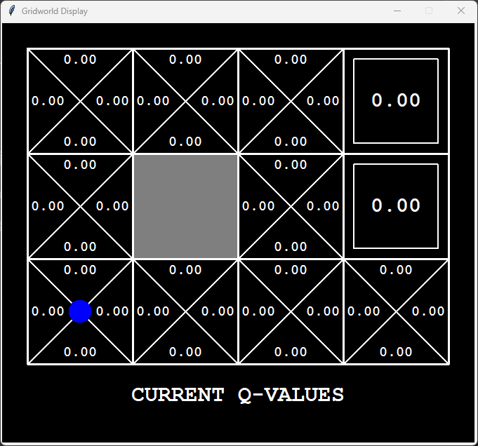

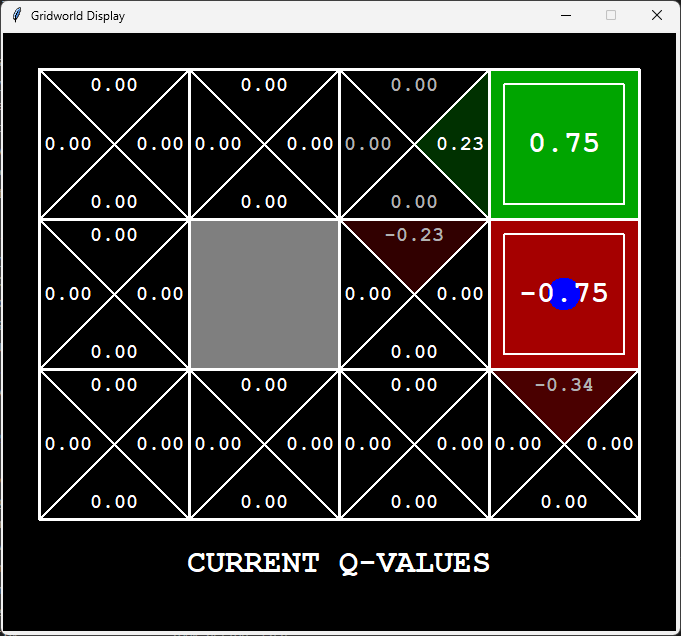

```
python gridworld.py -a q -k 5 -m

RUNNING 5 EPISODES

BEGINNING EPISODE: 1

Started in state: (0, 0)
Took action: east
Ended in state: (0, 1)
Got reward: 0.0

Started in state: (0, 1)
Took action: east
Ended in state: (0, 2)
Got reward: 0.0

Started in state: (0, 2)
Took action: east
Ended in state: (1, 2)
Got reward: 0.0

Started in state: (1, 2)
Took action: east
Ended in state: (2, 2)
Got reward: 0.0

Started in state: (2, 2)
Took action: east
Ended in state: (3, 2)
Got reward: 0.0

Started in state: (3, 2)
Took action: exit
Ended in state: TERMINAL_STATE
Got reward: 1

EPISODE 1 COMPLETE: RETURN WAS 0.5904900000000002

BEGINNING EPISODE: 2

Started in state: (0, 0)
Took action: east
Ended in state: (1, 0)
Got reward: 0.0

Started in state: (1, 0)
Took action: east
Ended in state: (2, 0)
Got reward: 0.0

Started in state: (2, 0)
Took action: east
Ended in state: (2, 1)
Got reward: 0.0

Started in state: (2, 1)
Took action: east
Ended in state: (3, 1)
Got reward: 0.0

Started in state: (3, 1)
Took action: exit
Ended in state: TERMINAL_STATE
Got reward: -1

EPISODE 2 COMPLETE: RETURN WAS -0.6561000000000001

BEGINNING EPISODE: 3

Started in state: (0, 0)
Took action: east
Ended in state: (1, 0)
Got reward: 0.0

Started in state: (1, 0)
Took action: east
Ended in state: (2, 0)
Got reward: 0.0

Started in state: (2, 0)
Took action: north
Ended in state: (2, 1)
Got reward: 0.0

Started in state: (2, 1)
Took action: north
Ended in state: (3, 1)
Got reward: 0.0

Started in state: (3, 1)
Took action: exit
Ended in state: TERMINAL_STATE
Got reward: -1

EPISODE 3 COMPLETE: RETURN WAS -0.6561000000000001

BEGINNING EPISODE: 4

Started in state: (0, 0)
Took action: north
Ended in state: (0, 1)
Got reward: 0.0

Started in state: (0, 1)
Took action: north
Ended in state: (0, 2)
Got reward: 0.0

Started in state: (0, 2)
Took action: east
Ended in state: (1, 2)
Got reward: 0.0

Started in state: (1, 2)
Took action: east
Ended in state: (1, 2)
Got reward: 0.0

Started in state: (1, 2)
Took action: east
Ended in state: (2, 2)
Got reward: 0.0

Started in state: (2, 2)
Took action: east
Ended in state: (3, 2)
Got reward: 0.0

Started in state: (3, 2)
Took action: exit
Ended in state: TERMINAL_STATE
Got reward: 1

EPISODE 4 COMPLETE: RETURN WAS 0.5314410000000002

BEGINNING EPISODE: 5

Started in state: (0, 0)
Took action: east
Ended in state: (1, 0)
Got reward: 0.0

Started in state: (1, 0)
Took action: east
Ended in state: (2, 0)
Got reward: 0.0

Started in state: (2, 0)
Took action: east
Ended in state: (3, 0)
Got reward: 0.0

Started in state: (3, 0)
Took action: north
Ended in state: (3, 1)
Got reward: 0.0

Started in state: (3, 1)
Took action: exit
Ended in state: TERMINAL_STATE
Got reward: -1

EPISODE 5 COMPLETE: RETURN WAS -0.6561000000000001


AVERAGE RETURNS FROM START STATE: -0.1692738
```